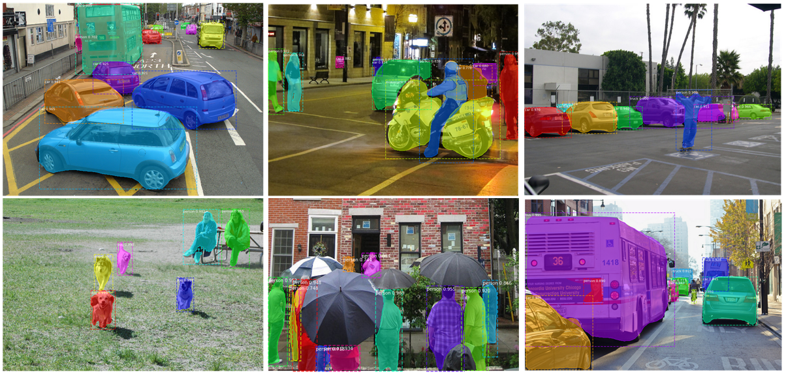

# Image Segmentation

One of the most significant applications of computer vision is the parsing of objects with correct contextual identification. In this project deep learning strategies and tools are applied in conjuction with Microsoft's Common Objects in Context ([MS COCO](https://cocodataset.org/#home)) image dataset to explore the identification and segmentation of objects and beings in images. A convolutional neural network is fine-tuned and applied to test images with the ultimate objective of demonstrating on a practical level object detection for tasks such as automated navigation.

## Model

This is an implementation of [Mask R-CNN](https://arxiv.org/abs/1703.06870) on Python 3, Keras, and TensorFlow developed by Waleed Abdulla in [Matterport](https://github.com/matterport/Mask_RCNN) GitHub repository. The model generates bounding boxes and segmentation masks for each instance of an object in the image. It's based on Feature Pyramid Network (FPN) and a ResNet101 backbone

## Setup the Environment

    - Python 3.7
    - Tensorflow version: 1.15.0
    - Keras version: 2.1.0

### Python modules used:
    - opencv-python 
    - tensorflow
    - keras 
    - numpy
    - argparse
    - scipy
    - Pillow
    - cython
    - matplotlib
    - scikit-image
    - tensorflow
    - keras
    - h5py
    - imgaug
    - IPython
    - pycocotools

### To install all modules run the command:

```bash
pip install -r requirements.txt
```

## Usage 

### Training detail:
* This model was trained on Google Colab, which has 12GB of RAM memory available, NVIDIA Tesla T4 GPU, and 30GB of disk memory;
* The [pre-trained weights](https://github.com/matterport/Mask_RCNN/releases/download/v2.0/mask_rcnn_coco.h5) used were trained on MS COCO dataset;
* This model detects and segments **7 categories** of the original MS COCO dataset: person, dog, car, motorcycle, bicycle, bus, and truck;
* The dataset used had 10500 images for training, **1500 images for each category**, and 3056 images for validation;
* The model was trained during 60 epochs;
* Each epoch has 1000 iterations and the learning rate was 0.001 for all the epochs;
* Were applied data augmentation via horizontal flip, vertical flip, and rotation for 70% of images per epoch.

### To download the images to training run the command:
- For Windows users:
    ```bash
    python f_aux/save_images.py train
    python f_aux/save_images.py val
    ```
- For Linux users:
    ```bash
    python3 f_aux/save_images.py train
    python3 f_aux/save_images.py val
    ```

### To train the model run the command:
- For Windows users:
    ```bash
    python src/train_model.py train --dataset=path/to/images --annotations=path/to/annotations --classes=7 --model=path/to/model
    ```
- For Linux users:
    ```bash
    python3 src/train_model.py train --dataset=path/to/images --annotations=path/to/annotations --classes=7 --model=path/to/model
    ```

### To evaluate the model on MS COCO metric run the command:
- For Windows users:
    ```bash
    python src/train_model.py evaluate --dataset=path/to/images --annotations=path/to/annotations --classes=7 --model=path/to/model
    ```
- For Linux users:
    ```bash
    python3 src/train_model.py evaluate --dataset=path/to/images --annotations=path/to/annotations --classes=7 --model=path/to/model
    ```

### To apply inference mode run the command [1]:
- For Windows users:
    ```bash
    python src/main.py --image=path/to/image.jpg
    ```
- For Linux users:
    ```bash
    python3 src/main.py --image=path/to/image.jpg
    ```    

[1]: The model weights will be download automatically after run this command.

## Segmentation results

### Visual results


### Average precision

| AP_bbox  | AP_segm  |
|:--------:|:--------:|
|   0.370  |  0.337   |
