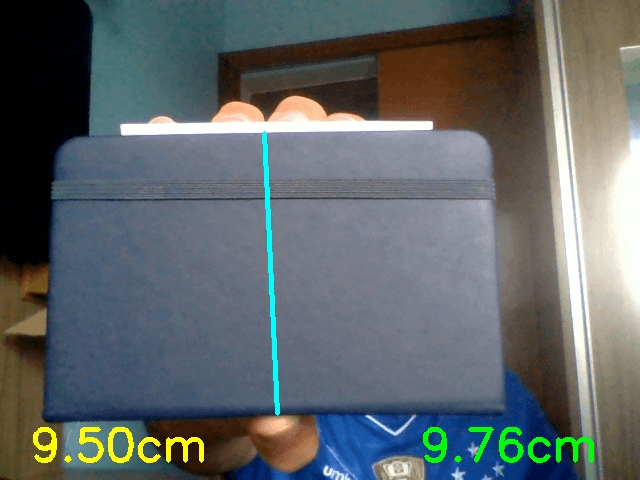
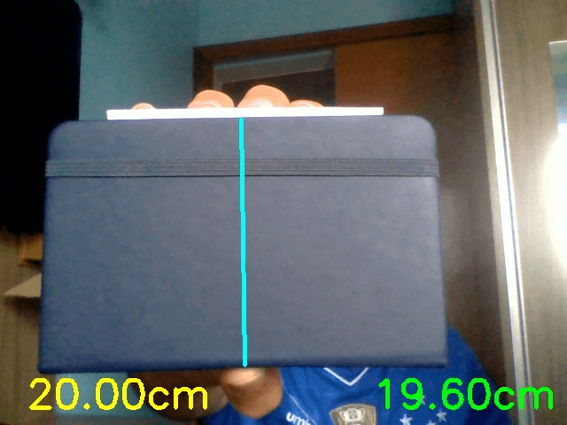

# Object Measurement

Mensura a distância ou o tamanho do objeto com tamanho ou distância conhecidos.

## Configuração

- Versão do Python: 3.10.7

### Crie um ambiente de desenvolvimento virtual

- No ambiente Windows, no bash do git, execute
```bash
python -m venv pOM
```

- No ambiente Linux, execute
```bash
python3.10 -m venv pOM
```

### Ative o ambiente de desenvolvimento virtual

- No ambiente Windows, no bash do git, execute
```bash
source pOM/Scripts/activate
```

- No ambiente Linux, execute
```bash
source pOM/bin/activate
```

### Instale as dependências

```bash
pip install -r requirements.txt
```

## Como usar

Para avaliar o código, ative o ambiente de desenvolvimento e execute o comando

```bash
python mede_objeto.py
```

## Resultados

### Altura do objeto



### Distância do objeto


