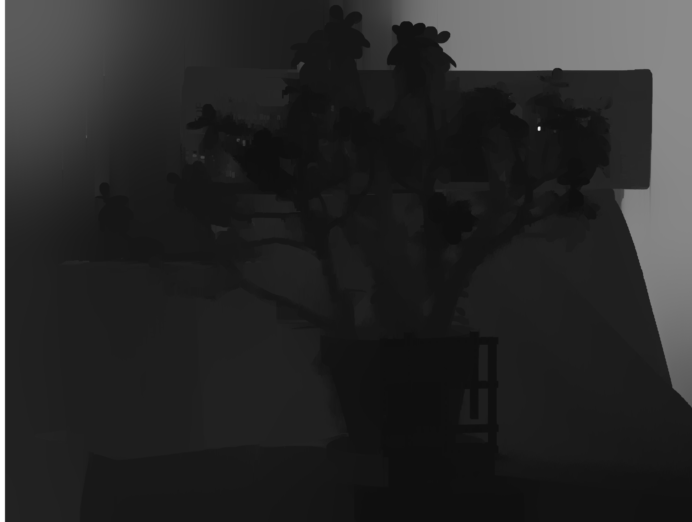
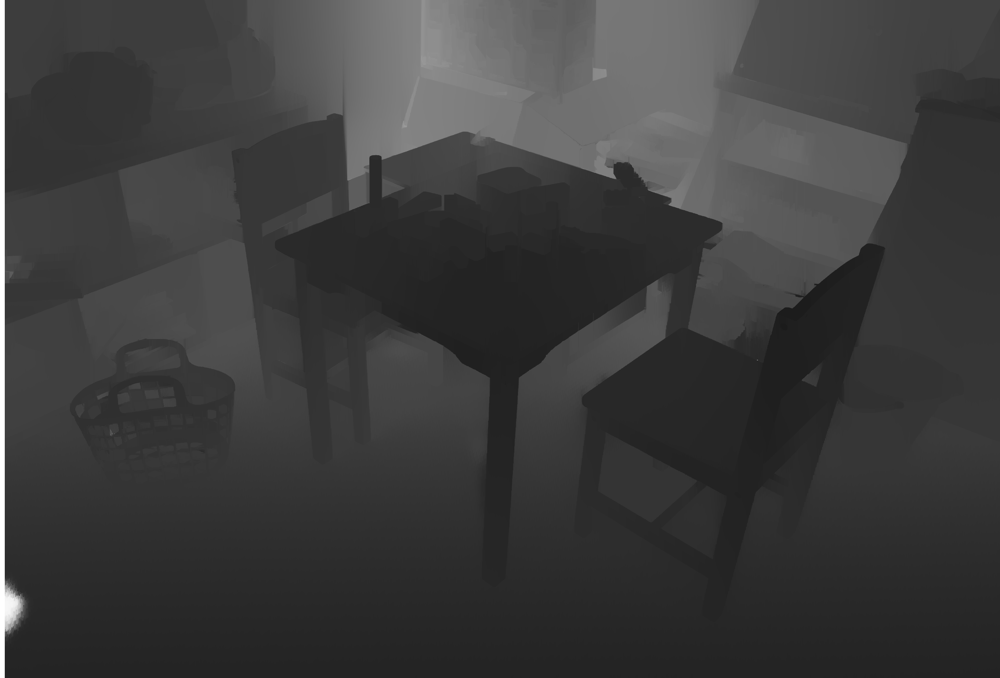

# Stereo Vision

## Requirements
      1 - Depth map estimate from rectified stereo images: Calculation of disparity and depth map for two groups of images from Middlebury image base, PlayTable and JadePlant;

      2 - Stereo cameras with convergence: Calculation of disparity and depth map for another group of image, Morpheus action figure, from Furukawa and Ponce 3D Photography Dataset;

      3 - Minimum box: Determing the minimum box dimensions in which the object of requeriment 2 can fit.

## Setup

- Python version: 3.10.7
- OpenCV version: 4.6.0.66

### Create an virtual environment

- On Windows (git bash)
```bash
python -m venv pSV
```

- On Linux
```bash
python3.10 -m venv pSV
```

### Activate the virtual environment

- On Windows (git bash)
```bash
source pSV/Scripts/activate
```

- On Linux
```bash
source pSV/bin/activate
```

### Install the requirements

```bash
pip install -r requirements.txt
```

## Usage

### To evaluate the requeriments run the command

``` bash
python src/main.py
```

### To evaluate the results of Middlebury images run the command

``` bash
python f_aux/eval.py
```

### To read .pfm file and extract the ground truth run the command

``` bash
python f_aux/middle.py
```

## Results 

### Depth map calculated for Middlebury images

| Original | Depth map |
|:--------:|:---------:|
|  |  |
|  | 
