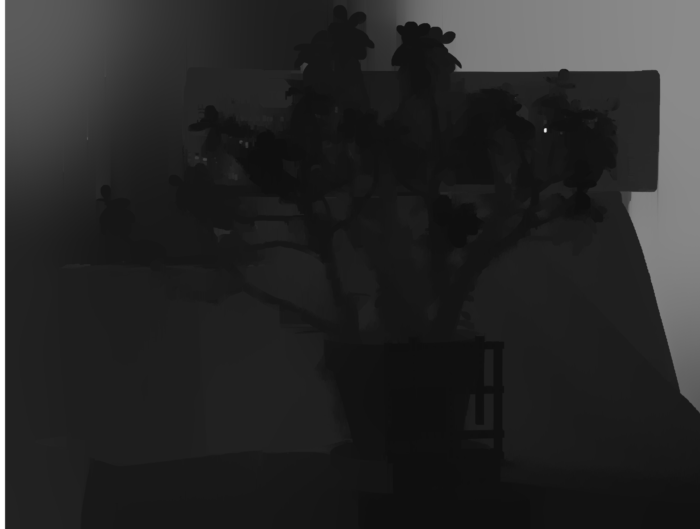
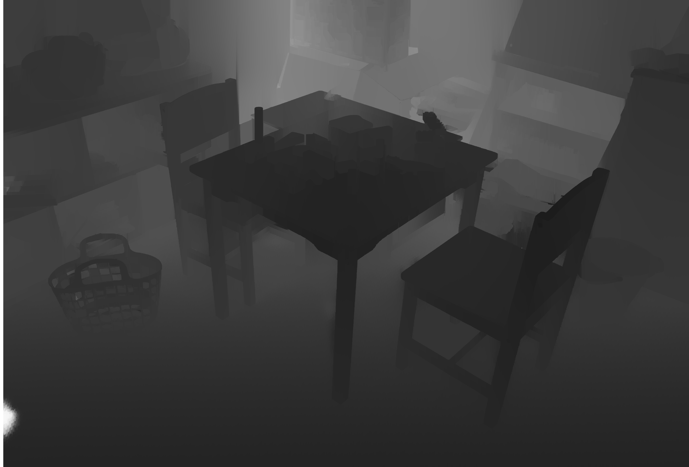

# Stereo Vision

### *Requirements:*
      1 - Depth map estimate from rectified stereo images: Calculation of disparity and depth map for two groups of images from Middlebury image base, PlayTable and JadePlant;

      2 - Stereo cameras with convergence: Calculation of disparity and depth map for another group of image, Morpheus action figure, from Furukawa and Ponce 3D Photography Dataset;

      3 - Minimum box: Determing the minimum box dimensions in which the object of requeriment 2 can fit.

### OpenCV version: 4.5.1
### Python 3

### Python modules used:
     - cv2 (contrib version) 
     - numpy  
     - os

### To install opencv contrib version with pip installer run the command:
>pip install opencv-contrib-python

### To evaluate the requeriments run the command:
- For Windows users:
>python src/main.py
- For Linux users:
>python3 src/main.py

### To evaluate the results of Middlebury images run the command:
>python f_aux/eval.py

### To read .pfm file and extract the ground truth run the command:
>python f_aux/middle.py

### Results of depth map calculated for Middlebury images

